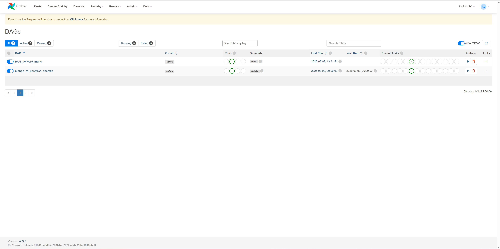
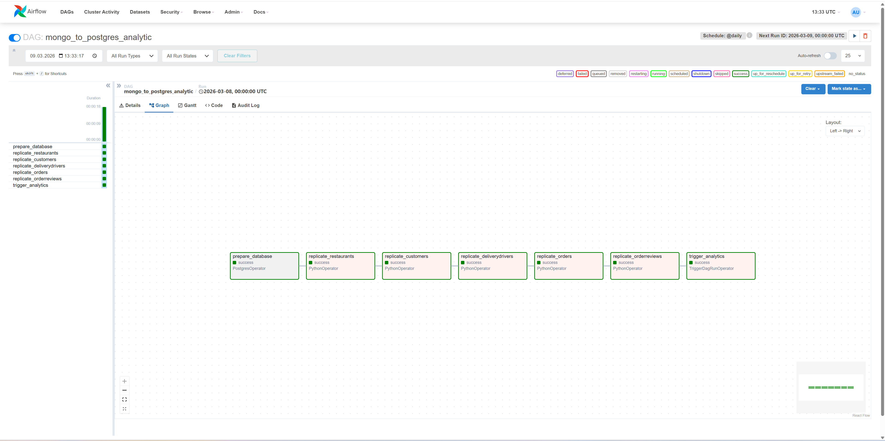
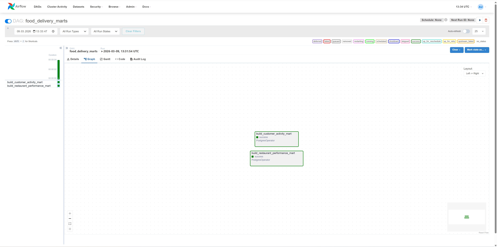
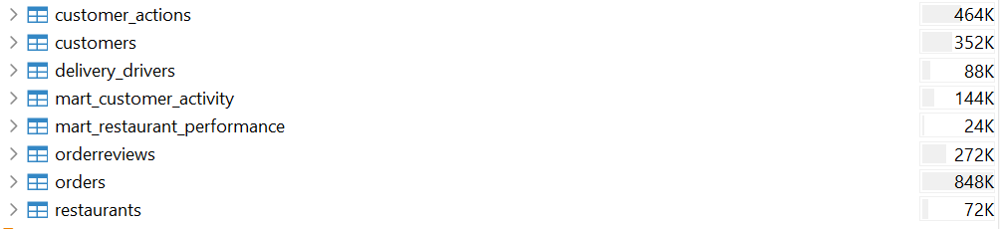
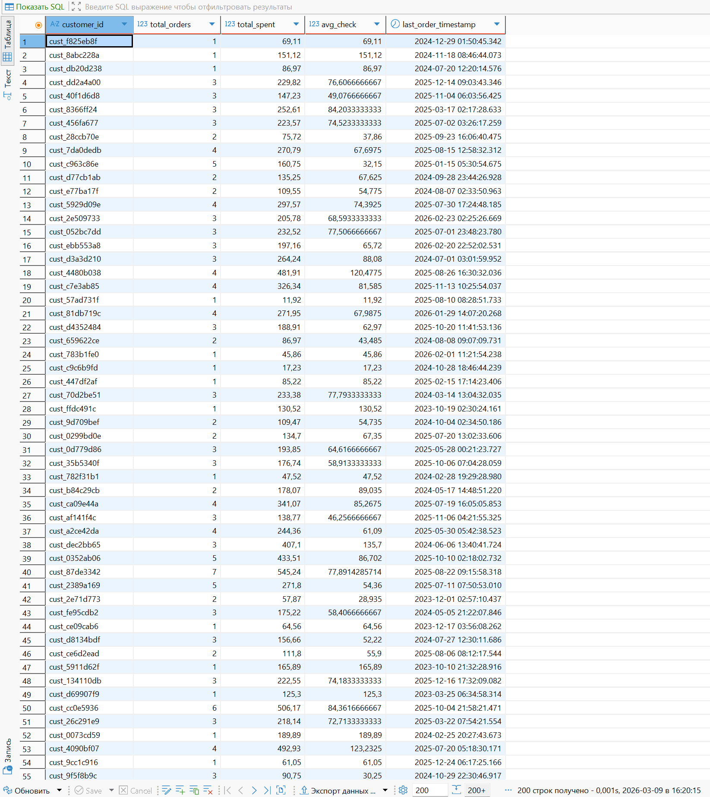
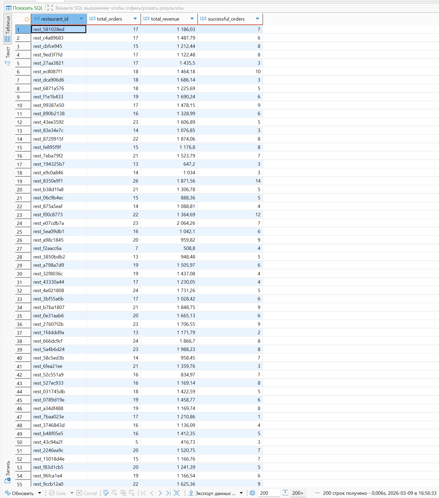

# Цель задания
Научиться реализовывать ETL-процесс, используя инструменты Apache Airflow,
PostgreSQL, MongoDB

# Структура проекта
```
itog_module_3/
├─ airflow/
│  ├─ dags/
│  │  ├─ sql/init_db.sql
│  │  ├─ replication_dag.py
│  │  └─ analytical_marts_dag.py
├─ init/init.sql
├─ jupyter/notebooks/GenerateDataAndResultMart.ipynb
├─ docker-compose.yml
└─ README.md
```

# Пайплайны

## DAG: `mongo_to_postgres_analytic`
Отвечает за перенос и подготовку данных из MongoDB в PostgreSQL.

Основные шаги:
1. **Подготовка базы (`prepare_database`)**

2. **Репликация коллекций из MongoDB в PostgreSQL**
    - Очистка данных.

3. **Триггер для запуска аналитических витрин**
    - После завершения репликации запускается DAG `food_delivery_marts`.

---

## DAG: `food_delivery_marts`
Отвечает за построение аналитических витрин.

### Витрина 1. `mart_customer_activity` — анализ активности клиентов
- Метрики: количество заказов, общая сумма, средний чек, дата последнего заказа.
- Цели:
    - Сегментация клиентов по активности и затратам
    - Выявление «лояльных» и «спящих» клиентов
    - Поддержка персонализированных маркетинговых кампаний

### Витрина 2. `mart_restaurant_performance` — эффективность работы ресторанов
- Метрики: количество заказов, суммарный доход, количество успешных доставок.
- Цели:
    - Выявление самых прибыльных и эффективных ресторанов
    - Анализ успешности выполнения заказов
    - Поддержка стратегий по стимулированию ресторанов и повышению качества обслуживания

# Результат











